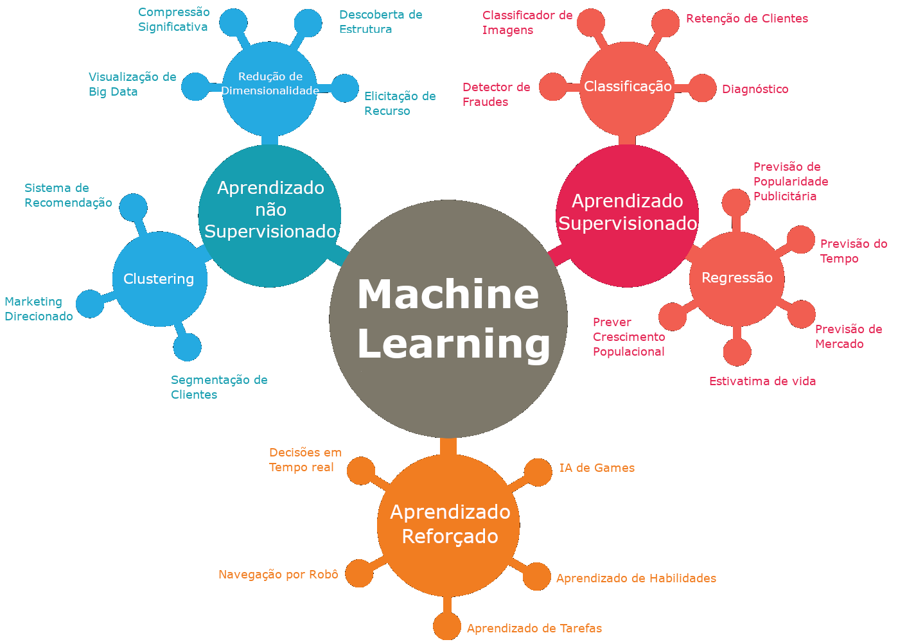

# O que é Machine Learning

Fazer um computador reconhecer padrões através de exemplos, invés de programá-lo com regras específicas. Esses padrões são encontrados em *datas* (dados).

> Machine = Sua máquina ou computador
> Learning = Descoberta de padrões em dados

**Machine Learning tem por objetivo:**
> A Criação de algoritmos (uma série de regras) cujo aprendizado vem de funções complexas (padrões) obtidos de dados objetivando a previsão dos mesmos.

**Resumindo em 3 passos:**
 - Coleta de dados
 - Encontrar padrões em dados
 - Prever novos padrões em dados

# Aplicações do Machine Learning

Antes de começar, vamos ver de formal geral do que machine learning é capaz:

 - **Assistência Médica:** Antecipar o diagnóstico de pacientes para encaminhamento médico
 - **Rede Social:** Prever certas preferências de match para uma maior compatibilidade
 - **Finanças:** Prever ações fraudulentas em cartões de crédito
 - **Biologia:** Encontrar padrões em mutações genéticas que podem indicar câncer

# Sistema de Aprendizado Supervisionado
Conhecidos com os dois pioneiros na área, Tom Mitchel e Michael l. Jordan, perceberam que dos mais recentes progressos em machine learning havia um mapeamento de uma série de entradas para uma série de saidas. Alguns exemplos:
| ENTRADA (X)                        | SAIDA (Y)                  | APLICAÇÃO  |
| :---------------------------------:|:--------------------------:|:-------------------------:|
| Gravador de voz                    | Script                     | Reconhecimento de voz     |
| Foto                               | Legenda                    | Marcador de imagem        |
| Transações de lojas                | A transação é fraudulenta? | Detector de fradues       |
| Receita e ingredientes             | Avaliação dos clientes     | Recomendar de refeições   |
| Localização e velocidade de carros | Fluxo do trânsito          | Semáforo                  |
| Rosto                              | Nomes                      | Reconhecimento facial     |

# Como Machine Learning funciona?

Basicamente, entenda que máquinas aprendem ao encontrar padrões em dados semelhantes. Pense em dados como informação que você descobre do mundo. Quanto mais dados são dados para máquina mais inteligente ela fica.

Mas nem todos os dados são parecidos. Imagina que você é um pirata e sua missão de vida é encontrar o tesouro perdido em uma ilha. Para encontrar o tesouro você irá precisar de várias informações. Por exemplo, dados, essas informações podem leva-lo tanto para direção certa quanto a errada. Quanto melhor for as informações/dados, mais a incerteza será reduzida e vice versa. Então é importante estar ciente do tipo de dado que você vai fornecer para maquina aprender.

> "Mais dados superam modelos melhores. Dados melhores superam mais dados." — Riley Newman

No entanto, só depois que é dada uma certa quantidade de informações é que a maquina será capaz de fazer previsões. Máquinas conseguem prever o futuro com tanto que o futuro não esteja tão diferente do passado.

Máquinas aprendem pra valer quando usamos dados do passado para prever informações sobre o que é mais provável que aconteça. Se o dados antigos se assemelham bastante com os novos dados, então podemos dizer que os dados antigos vão provavelmente serem relevantes aos novos dados. É como se fossemos usar o passado para prever o futuro.

# Tipos de Machine Learning

Existem três categorias principais dentro do machine learning:

- **Aprendizado supervisionado**: A máquina aprende apartir de dados especificados, normalmente especificado por humanos.
- **Aprendizado não supervisionado**: A máquina aprende apartir de dados não especificados. Onde não há resposta "certa" entregue para maquina aprender, mas a maquina precisa encontrar padrões apartir dos dados para nos fornecer a resposta.
- **Aprendizado reforçado**: A máquina aprende através de um sistema de recompensas.

# Aprendizado supervisionado

É o tipo de aprendizado mais comum e estudado por conta da sua facilidade de treinar a máquina com dados especificados, do que de não especificados. Dependendo do seu objetivo, o aprendizado supervisionado pode ser usado para resolver dois tipos de problemas: regressão ou classificação.

#### Regressão:

 Se você procurar prever valores contínuos, tais como, prever o custo de uma casa ou a temperatura de um lugar em graus, você usaria regressão. Esse tipo de problema não tem uma restrição de valor específico, porque o valor pode ser qualquer numero sem limites.
 
#### Classificação:

Se você procurar prever valores discretos, tais como, classificar algo em determinada categoria, o ideal é usar classificação. Um problema como, "Ele irá fazer essa compra?" Teremos uma resposta que cai em duas categorias específicas: sim ou não. Isso também é chamado de problema de classificação binária.

# Aprendizado não supervisionado

Já que existem dados não especificados para máquinas aprenderem, o objetivo do aprendizado não supervisionado é detectar padrões em dados e agrupá-los. Aprendizado não supervisionado são máquinas tentando aprender por "conta própria", sem auxílio. Imagine alguém te lançando um monte de dados e dizendo "Nesse monte de informação ai, encontre alguns padrões e separa eles pra mim. Obrigado e se divirta."

Dependendo do que você queira agrupar juntamente, o aprendizado não supervisionado pode agrupar os dados juntos por: clustering ou associação

#### Problema do Clustering:

 O aprendizado não supervisionado tentar resolver esse problema ao procurar por semelhanças nos dados. Se há um cluster simples ou um grupo, o algoritmo então categoriza eles de uma certa forma. Um exemplo disso poderia ser tentar agrupar os clientes baseado nas suas comprar anteriores.

#### Problema da Associação:

O Aprendizado não supervisionado tenta resolver esse tipo de problema ao tentar entender as regras e o significado por trás dos diferentes grupos. Encontrar um relacionamento entre o cliente e suas compras é um exemplo comum do problema da associação. Lojas talvez queiram saber o tipo de produto que são comprados juntos e podem provavelmente usar essa informação para organizar a posição desses produtos para um acesso mais fácil. Uma loja descobriu que havia uma forte relação entre clientes comprando bebidas e fraldas. Apartir disso eles deduziram que homens que saem de casa para comprar fraldas para seus bebês, também buscavam comprar bebida.

# Aprendizado de Máquina reforçado:

Esse tipo de machine learning necessita do uso de um sistema de recompensa/penalidade. O objetivo é recompensar a máquina quando ela aprende de forma certa e puni-la quando aprende de forma errada.

O Aprendizado de Máquina reforçado é um sunconjunto da Intelgencia Artificial. Com uma grande gama de respostas possiveis dos dados, o processo desse tipo de aprendizado é um passo interativo. Continua aprendendo.

#### Exemplos de Aprendizado de Máquina reforçado:

Treinando uma maquina pra aprender como jogar [(Tabuleiro, Go)](https://www.youtube.com/watch?v=g-dKXOlsf98)

Treinando a maquina como aprender e joga [Mario](https://www.youtube.com/watch?v=qv6UVOQ0F44) por contra própria

Veículos autônomos

# Finalizando

Este artigo é uma adaptação afim de torna mais claro o tópico discutido. Dedico toda elucidação de ideias para o artigo original. A seguir: **[A Beginner’s Guide to Machine Learning](https://towardsdatascience.com/a-beginners-guide-to-machine-learning-5d87d1b06111)**
